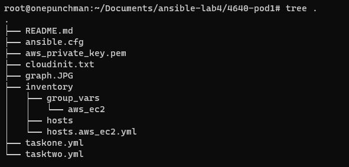
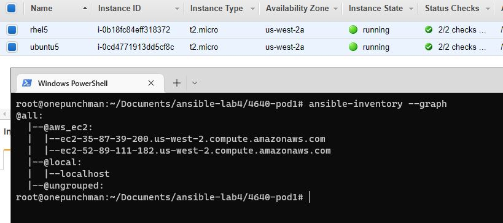

# 4640-pod1

## Pre-configuration

We will choose AWS and Ansible to manage our VMs in cloud. Therefore:
- make sure you already installed ansible in your local machine 
- create a user group and user for ansible to access the VMs in AWS

In the second step, you will get a CSV file which contain a access key and secret. Make sure you export them to your environment.

```
export AWS_ACCESS_KEY_ID= <AKI>
export AWS_SECRET_ACCESS_KEY= <>
```

After that, you can launch two VMs in EC2. One is **Ubuntu, 22.04 LTS** and another is **Red Hat Enterprise Linux 8**. Two versions are all free tire. 

When you launching the Ubuntu linux, add a cloudinit in the user data section at the bottom part. Since in AWS, the default username to is different based on version. Here we unify the username to **ec2-user** (don't forget to change the username when you ssh to ubuntu vm) otherwise ansible can't access two vms at the same time

```
#cloud-config
system_info:
  default_user:
    name: ec2-user
```
Then you can clone my repo and put your .pem key file into the root folder, the structure should be like this



You also can change the file path and name in the /inventory/group_vars/aws_ec2 **ansible_ssh_private_key_file** parms.

In the root dir, run **ansible-inventory --graph** you should be able to get this. 



## Taskone

Now we have two vms ready, let's configure them by ansible. In task one we will do the following things
- Create a new user
- Create a home dir in the new user's home
- Copy .ssh folder in default user to home we created in new user
    * and change the owner to new user
- Bash will be their login shell
- New user can use sudo without pass
- Ssh will no longer be the root user

Running it by cmd **ansible-playbook taskone.yml**
```
taskone.yml
---
- hosts: aws_ec2
  tasks:
    - name: add user benny with sudo in ubuntu
      # create a user with password 'password' and add them to the sudo group(can use sudo in ubuntu)
      become: true
      user:
        name: benny
        password: "{{ 'password' | password_hash('sha512') }}"
        groups: sudo
        append: yes
      when: ansible_distribution in ["Ubuntu", "Debian"]

    - name: add user benny with sudo in rhel
      # create a user with password 'password' and add them to the wheel group in rhel
      become: true
      user:
        name: benny
        password: "{{ 'password' | password_hash('sha512') }}"
        groups: wheel
        append: yes
      when: ansible_distribution in ["RedHat","Fedora", "CentOS"]

    - name: Allow 'wheel' group to have passwordless sudo
      # make the wheel group can use sudo without pass in rhel
      become: true
      lineinfile:
        dest: /etc/sudoers
        state: present
        regexp: '^%wheel'
        line: '%wheel ALL=(ALL) NOPASSWD: ALL'
        validate: 'visudo -cf %s'
      when: ansible_distribution in ["RedHat","Fedora", "CentOS"]

    - name: change user shell to bash
      # change new user shell to bash when login
      become: true
      user:
        name: benny
        shell: /bin/bash

    - name: create home dir
      # create the home dir by new user in their home's folder
      file:
        path: "~/home"
        state: directory
      become: true
      become_method: sudo
      become_user: benny

    - name: Copy file with owner and permissions
      # copy the .ssh folder to the new home folder and change the owner to new user
      become: true
      copy:
        src: /home/ec2-user/.ssh/
        dest: /home/benny/home/.ssh/
        owner: benny
        remote_src: yes # src in the vm not in our local machine

    - name: replace root login ubuntu
      # replace the permitrootlogin parms in ubuntu
      become: true
      replace:
        path: /etc/ssh/sshd_config
        regexp: "#PermitRootLogin prohibit-password" # target to replace
        replace: "PermitRootLogin no" # replace result
      when: ansible_distribution in ["Ubuntu", "Debian"]

    - name: replace root login rhel
      # replace the permitrootlogin parms in rhel
      become: true
      replace:
        path: /etc/ssh/sshd_config
        regexp: "PermitRootLogin yes" # target to replace
        replace: "PermitRootLogin no" # replace result
      when: ansible_distribution in ["RedHat","Fedora", "CentOS"]
      
    - name: restart sshd
      # restart the services make the changes effective
      become: true
      service:
        name: sshd
        state: restarted
```

## Tasktwo

Task two content
- install podman
- pull the httpd image
- running the httpd image

Running it by cmd **ansible-playbook tasktwo.yml**

```
---
- hosts: aws_ec2
  tasks:
    - name: Update apt-get repo and cache in ubuntu
      # running apt-update in ubuntu before install podman
      become: true
      apt: update_cache=yes force_apt_get=yes cache_valid_time=3600
      when: ansible_distribution in ["Ubuntu", "Debian"]
      
    - name: Upgrade all apt packages in ubuntu
      # running apt-upgrade in ubuntu before install podman
      become: true
      apt: upgrade=dist force_apt_get=yes
      when: ansible_distribution in ["Ubuntu", "Debian"]
      
    - name: installing podman in ubuntu
      # install podman in ubuntu
      become: true
      apt:
        name: podman
      when: ansible_distribution in ["Ubuntu", "Debian"]

    - name: install podman in rhel
      # install podman in rhel
      become: true
      yum:
        name: podman
        state: present
      when: ansible_distribution in ["RedHat","Fedora", "CentOS"]

    - name: pull image
      # pull the httpd image by podman
      containers.podman.podman_image:
        name: docker.io/library/httpd
        pull: true
        tag: latest

    - name: Run apache container
      # run the container from the image by podman
      containers.podman.podman_container:
        name: container
        image: docker.io/library/httpd
        state: started
```

You can check the running status by ssh to the VM and type **podman ps**. Because there are few downloading and installing stage, tasktwo may need to wait for a while.